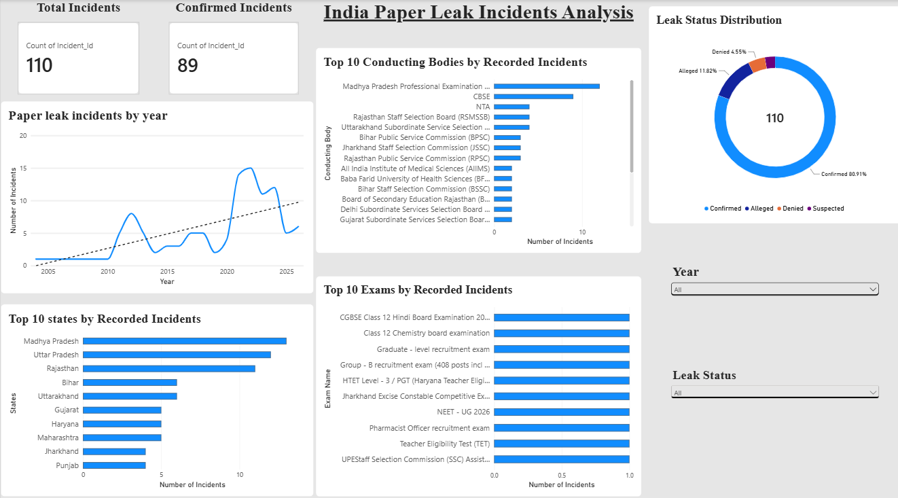

# India Paper Leak Incidents Analysis

## 📌 Project Overview

This project analyzes recorded paper-leak incidents in India using Python and Power BI.

The analysis explores patterns in recorded incidents across years, affected areas, conducting bodies, examinations, and leak status. A simple Decision Tree classification model is also developed to classify recorded incidents as Confirmed or Not Confirmed.

## 🎯 Objectives

- Analyze year-wise trends in recorded paper-leak incidents
- Examine the distribution of leak status
- Identify frequently affected areas
- Analyze conducting bodies associated with recorded incidents
- Identify examinations that appear most frequently in the dataset
- Explore year-to-year changes in recorded incidents
- Build a basic machine learning classification model

## Tools & Technologies

- Python
- Pandas
- NumPy
- Matplotlib
- Scikit-learn
- Jupyter Notebook
- Power BI
- Excel

## 📊 Dataset

The dataset contains **110 recorded paper-leak incidents** in India.

Key variables include:

- Date
- Exam Name
- Conducting Body
- Body Type
- Area
- Leak Status
- Action Taken
- Incident Type

## 🔎 Python Analysis

The Python notebook covers:

- Dataset inspection
- Data quality checks
- Year-wise analysis
- Leak status analysis
- Area-wise analysis
- Conducting body analysis
- Examination frequency analysis
- Year-to-year changes
- Exploratory statistical analysis

## 🤖 Machine Learning

A Decision Tree classifier is used to classify recorded incidents into:

- **Confirmed**
- **Not Confirmed**

The model uses features such as:

- Year
- Exam Name
- Conducting Body
- Body Type
- Area
- Incident Type

The model is evaluated using:

- Accuracy
- Confusion Matrix
- Classification Report
- Decision Tree Visualization

### ⚠️ Model Limitation

The machine learning model is exploratory. The dataset contains recorded leak incidents rather than a complete set of examinations with both leak and non-leak outcomes.

Therefore, the model should **not** be interpreted as a predictor of whether a future examination will experience a paper leak.

## 📈 Power BI Dashboard

The Power BI dashboard provides an interactive overview of recorded paper-leak incidents in India.



The dashboard includes:
- Total recorded incidents
- Confirmed incidents
- Year-wise incident trends
- Top affected states/UTs
- Top conducting bodies
- Leak status distribution
- Frequently recorded examinations
- Year and leak-status filters

## 📁 Project Structure

```text
india-paper-leaks-analysis/
│
├── India_Paper_Leaks.ipynb
├── India_Paper_Leaks.xlsx
├── README.md
│
└── PowerBI/
    └── India_Paper_Leaks.pbix
